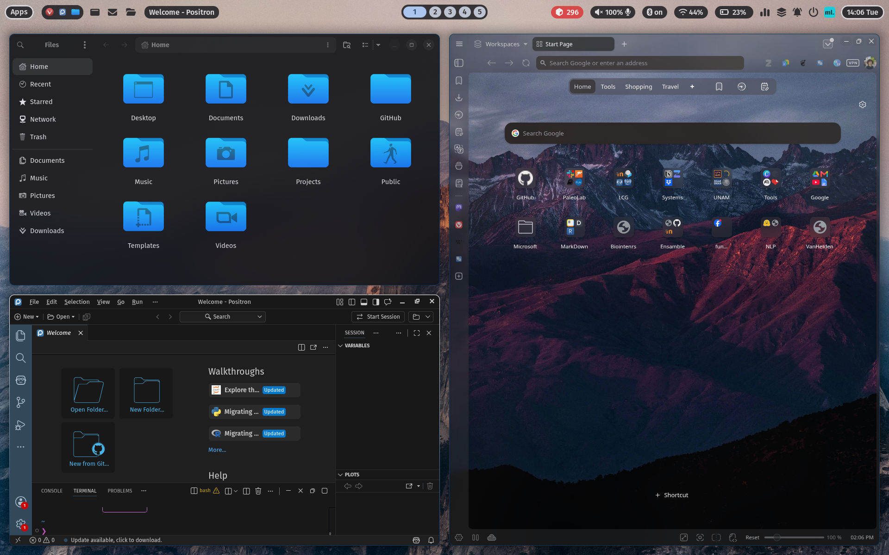
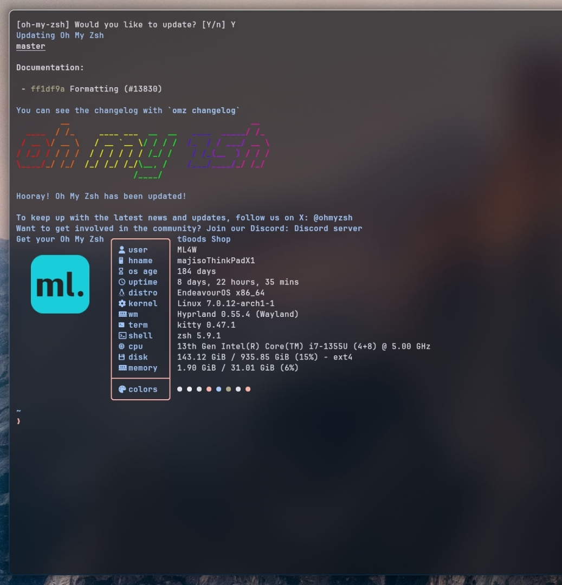
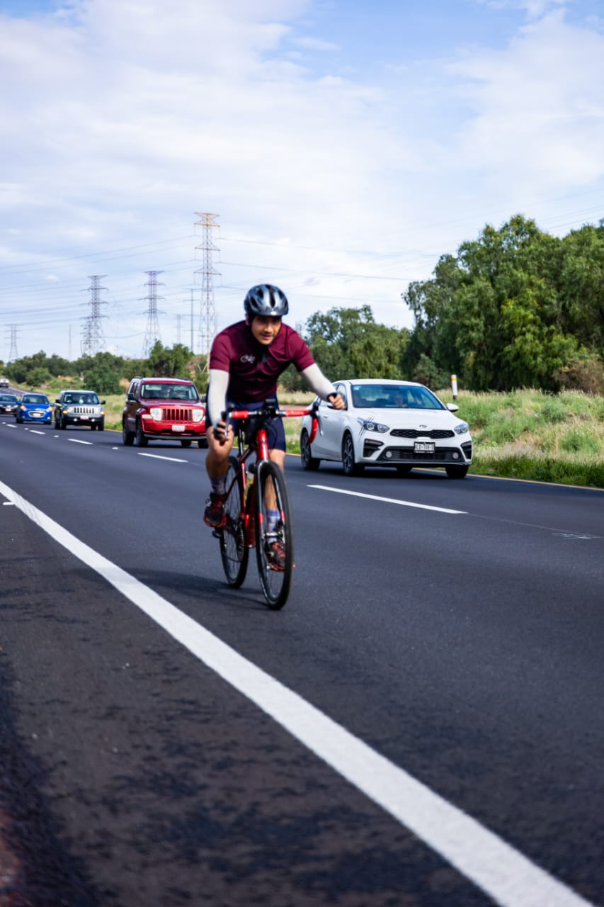
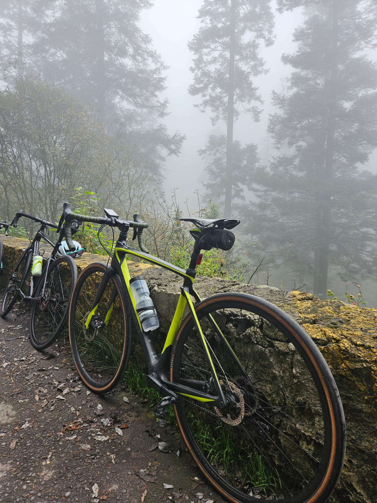
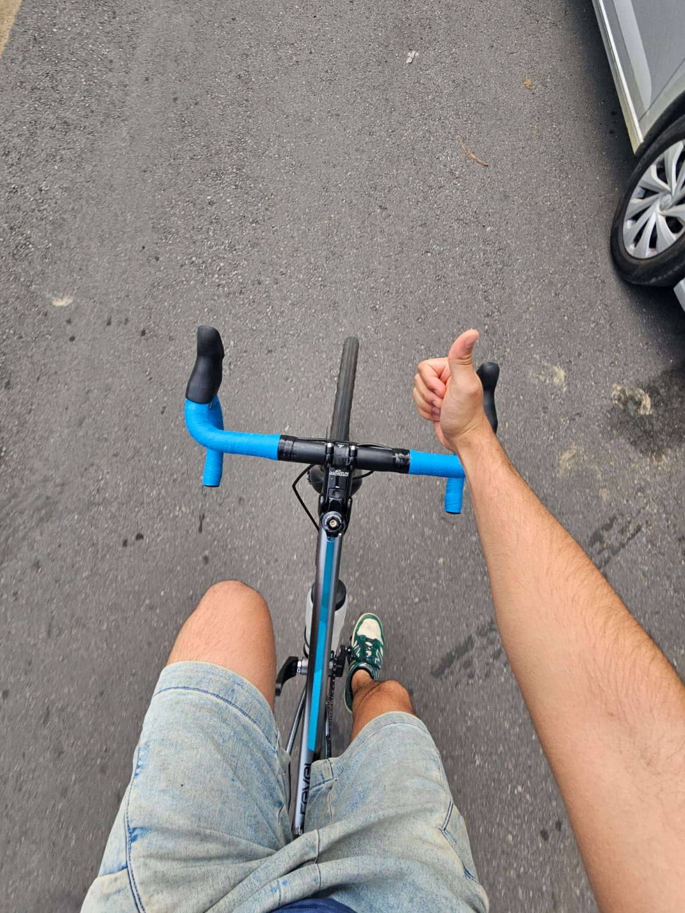
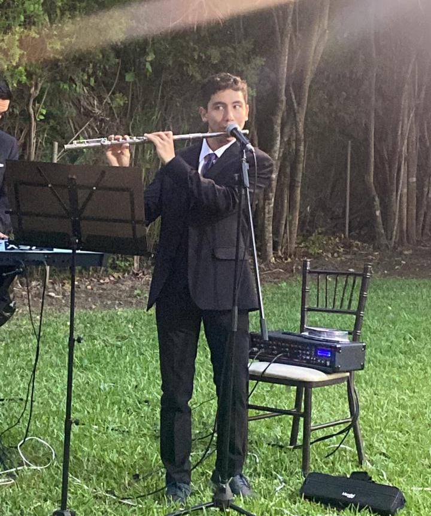
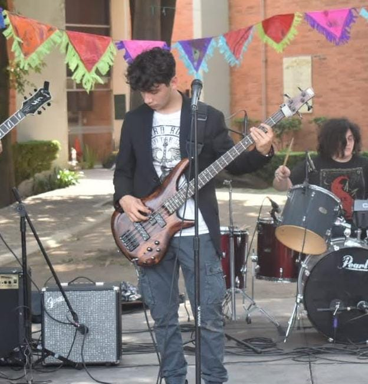
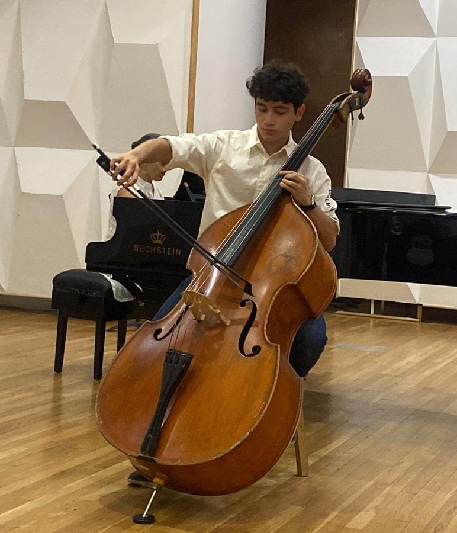

## Linux!

<left>

I'm an enthusiastic **Linux** user and a strong supporter of open-source software. I love exploring different distros, experimenting with desktop environments and window managers, and learning more about the Unix ecosystem. Lately, I've been using **Arch Linux** and learning **Hyprland**, while refining my command-line workflow and customizing my desktop through dotfiles, terminal applications, and window manager configurations.

In my opinion, Linux is not only an operating system, but a platform for learning and experimentation!

  
  

</left>

---

## Cycling

<left>
Cycling is my favorite way to disconnect from the computer and explore new places, particularly when my routes take me along open **roads**, winding **gravel** trails, or bustling city **streets**. Whether it's a short ride or an all-day adventure, cycling has become an important part of my daily life!

  
  
  

</left>

---

## Music

<left>
Music has always been part of my life. I’m mainly drawn to jazz, classical, progressive rock, and *rock en español*. I studied double bass and even performed in an orchestra, an experience that taught me discipline, teamwork, and careful listening. Over the years, I’ve learned to play several instruments, including **flute**, **bass**, and **double bass**.

  
  
  

</left>
